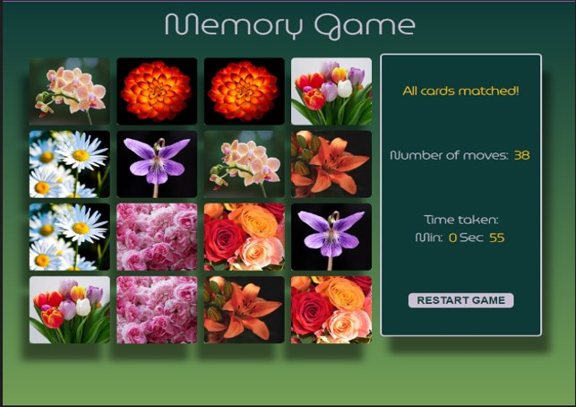

# Memory game - Matching cards



## Description

Game has 16 cards arranged face down in a grid layout. On reload and restart cards are shuffled randomly. Cards when clicked rotate 180 degree to reveal an image of a flower. Player clicks on 2 cards consecutively. If cards match they remain face up else turn face down again. Game ends when all cards are matched. A game stats panel displays `Time taken`, `Number of moves` and a message. A `Restart` button flips cards back and resets the time and number of moves.

## Plan

\* Design mobile first and then make the site laptop responsive: Sketch the user interface layout to visualize how the game stats panel would change position in different layouts.

\* Generate data for the game by creating an array of objects with 8 pairs of images. The object would have the image source link, the image name and to uniquely identify them an image id. Create function to shuffle the images.

\* User Interface: Grid layout to evenly place the cards and resize them for different layouts. CSS transform properties to flip the cards when clicked. Use transition and shadow properties to give smooth roll over movement to the cards.

\* Game feature functions:

> \* Function to randomize the cards.  
> \* Function to create cards with a front and back panel. Front panel would use images from the array.  
> \* CSS for the grid layout and card transitions.  
> \* Add event listners on cards. Function to check if cards match and depending on the result cards would flip back or stay facing up.  
> \* Create stop watch and restart game function.

## Building

\* Use sort function to randomize the sequence of images.

\* Dynamically generate cards by creating divs. Loop through the shuffled images to use on the front panel. Assign an image name attribute to identify individual cards.

\* Add event listener on cards to check if card is clicked and log 2 consecutive clicks as 1 move. A class `flip` would toggle the front and back of the card.

\* Create a compare cards function which would add a new class of `selected` to the cards when clicked. The cards would be put in an array and on the array length becoming 2 the images would be compared to check if they match based on their name attribute. If they matched a css pointer property would make them unclickable and their `selected` class would be removed. If not the cards would flip back after a second.

\* Build a timer function to count seconds and minutes. Then create functions to start, stop and reset the timer. Call the start function on the first move and stop function when all cards match. Reset function would be called inside the restart function.

\* Build a restart function for the restart button to set moves to 0 and call functions to create cards and reset timer.

## Debugging

\* For debugging at every stage I used

```javascript
console.log();
```

\* I had to check if the classes of `Selected` and `Flip` were being applied and if the cards registered their status of getting matched or not.
